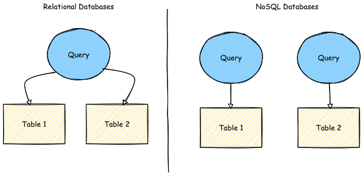
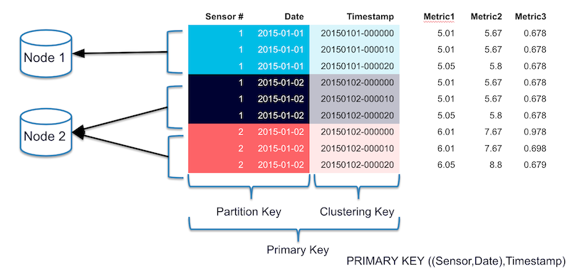

## Apache Cassandra

***Project นี้ทำการ Create teble ประกอบไปด้วย id, type, public และกำหนดให้ PRIMARY KEY = id, type จากนั้นทำการ connect จัดเก็บไว้ใน Cassandra***

**Cassandra => เป็น NoSQL Database ชนิดหนึ่ง ซึ่งกระจายการเก็บข้อมูลไว้หลายๆ Node มีจุดเด่นในเรื่องของการขยาย (scalability) และความพร้อมใช้ (high availability) อีกทั้งยังมีความเร็วสูง (performance) สามารถขยายแบบ linear ได้ ซึ่ง Primary Key จะประกอบไปด้วย Partition Key + (Clustering Key) = Primary Key  ต้องมีการออกแบบ data model ตามการใช้งาน query ของเราเนื่องจากไม่สามารถทำการ join ข้อมูลข้าม table ได้**

Credit: https://www.instaclustr.com/blog/cassandra-data-partitioning/

